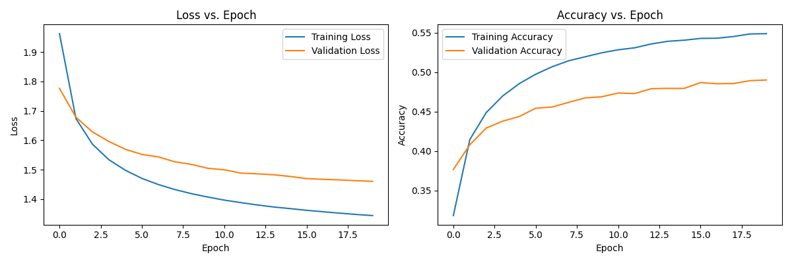
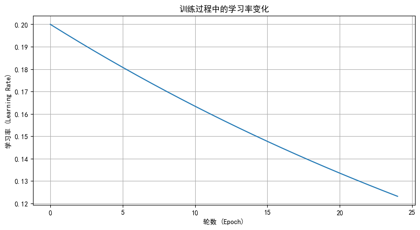
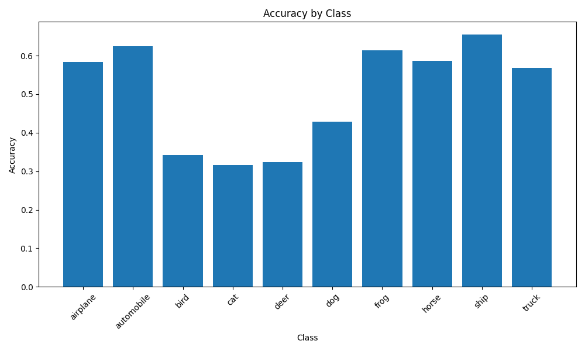
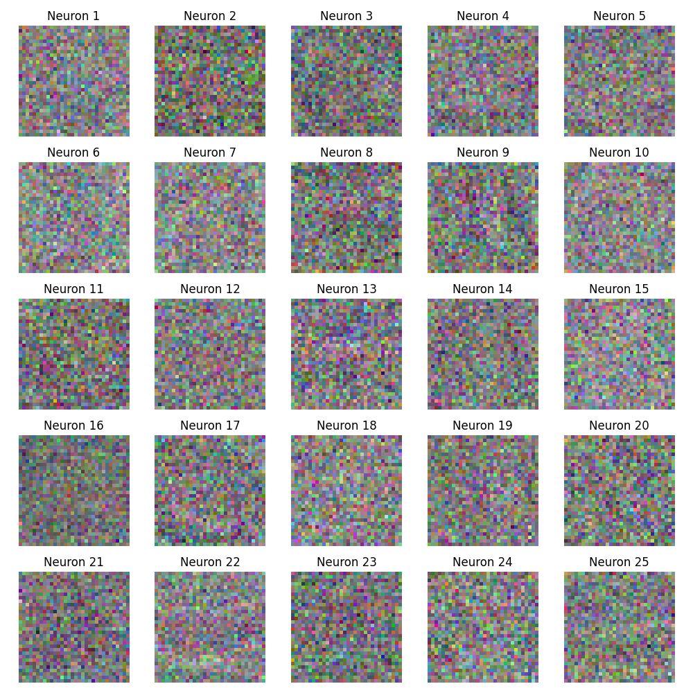
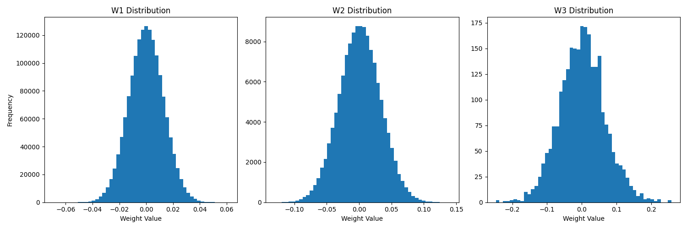

# 三层神经网络分类器模型报告

## 1. 模型介绍

本项目实现了一个从零开始手工构建的三层神经网络分类器，不依赖任何深度学习框架，而是通过NumPy手动实现了神经网络的前向传播、反向传播、各种激活函数、损失函数和优化器等核心组件。

具体原理说明见[项目说明](项目说明.ipynb)

### 1.1 模型架构

模型采用了经典的三层神经网络结构：

- **输入层**：接收CIFAR-10图像数据，维度为3072（32×32×3）
- **第一隐藏层**：可配置的神经元数量，默认为512个神经元
- **第二隐藏层**：可配置的神经元数量，默认为256个神经元
- **输出层**：10个神经元，对应CIFAR-10的10个类别

### 1.2 激活函数

- **隐藏层**：使用ReLU激活函数，帮助解决梯度消失问题
- **输出层**：使用Softmax激活函数，将输出转换为概率分布

### 1.3 损失函数

使用交叉熵损失函数，适用于多分类问题。

### 1.4 优化器

使用带动量的随机梯度下降（SGD）优化器，并支持L2正则化以防止过拟合。

### 1.5 参数初始化

使用Xavier/Glorot初始化方法初始化权重，有助于解决训练初期的梯度消失/爆炸问题。

```python
# 权重初始化示例
self.params['W1'] = np.random.randn(input_size, hidden_size1) * np.sqrt(2.0 / input_size)
self.params['b1'] = np.zeros(hidden_size1)
self.params['W2'] = np.random.randn(hidden_size1, hidden_size2) * np.sqrt(2.0 / hidden_size1)
self.params['b2'] = np.zeros(hidden_size2)
self.params['W3'] = np.random.randn(hidden_size2, output_size) * np.sqrt(2.0 / hidden_size2)
self.params['b3'] = np.zeros(output_size)
```

## 2. 数据集介绍

### 2.1 CIFAR-10数据集

CIFAR-10是一个广泛使用的计算机视觉数据集，包含10个类别的60,000张32×32彩色图像：

- 飞机（airplane）
- 汽车（automobile）
- 鸟（bird）
- 猫（cat）
- 鹿（deer）
- 狗（dog）
- 青蛙（frog）
- 马（horse）
- 船（ship）
- 卡车（truck）

数据集被分为50,000张训练图像和10,000张测试图像。

### 2.2 数据预处理

数据预处理步骤包括：

1. **归一化**：将像素值从[0, 255]归一化到[0, 1]范围
2. **标准化**：对数据进行零均值、单位方差的标准化处理
3. **数据分割**：将训练集进一步分割为训练集和验证集（90%训练，10%验证）

```python
# 数据预处理代码示例
X_train = X_train.astype('float32') / 255.0  # 归一化
X_test = X_test.astype('float32') / 255.0

scaler = StandardScaler()  # 标准化
X_train = scaler.fit_transform(X_train)
X_test = scaler.transform(X_test)

# 分割训练集和验证集
X_train, X_val, y_train, y_val = train_test_split(
    X_train, y_train, test_size=validation_split, random_state=42
)
```

## 3. 超参数搜索与最佳模型

为了找到最佳的模型配置，项目实现了网格搜索和随机搜索两种超参数搜索方法。

### 3.1 默认超参数配置

在config.py中的DEFAULT_CONFIG，模型的默认超参数配置如下：

#### 3.1.1 模型参数

- **输入大小(input_size)**: 3072 (32×32×3，CIFAR-10图像展平后的维度)
- **第一隐藏层大小(hidden_size1)**: 512个神经元
- **第二隐藏层大小(hidden_size2)**: 256个神经元
- **输出大小(output_size)**: 10 (CIFAR-10的10个类别)
- **隐藏层激活函数(hidden_activation)**: ReLU
- **输出层激活函数(output_activation)**: Softmax

#### 3.1.2 训练参数

- **损失函数(loss)**: 交叉熵(cross_entropy)
- **优化器(optimizer)**: SGD
- **学习率(learning_rate)**: 0.2
- **动量系数(momentum)**: 0.9
- **权重衰减(weight_decay)**: 0.0001 (L2正则化系数)
- **批量大小(batch_size)**: 256
- **训练轮数(epochs)**: 25

#### 3.1.3 学习率调度

- **调度器类型(scheduler)**: step (步长衰减)
- **调度器参数(scheduler_params)**:
  - **step_size**: 1 (每1个epoch调整一次学习率)
  - **gamma**: 0.98 (每次调整将学习率乘以0.98)

#### 3.1.4 数据参数

- **验证集比例(validation_split)**: 0.1 (10%的训练数据用作验证集)

### 3.2 超参数搜索空间

项目实现了两种超参数搜索方法：网格搜索和随机搜索。根据config.py中的SEARCH_CONFIG，超参数搜索空间如下：

#### 3.2.1 网格搜索参数空间

- **第一隐藏层大小(hidden_size1)**: [128, 256, 512]
- **第二隐藏层大小(hidden_size2)**: [64, 128, 256]
- **隐藏层激活函数(hidden_activation)**: ['relu', 'tanh']
- **学习率(learning_rate)**: [0.1, 0.01, 0.001]
- **动量系数(momentum)**: [0.0, 0.9]
- **权重衰减(weight_decay)**: [0.0, 0.0001, 0.001]

#### 3.2.2 随机搜索参数空间

- **第一隐藏层大小(hidden_size1)**: [128, 256, 512, 1024]
- **第二隐藏层大小(hidden_size2)**: [64, 128, 256, 512]
- **隐藏层激活函数(hidden_activation)**: ['relu', 'tanh']
- **学习率(learning_rate)**: 对数均匀分布在10^(-4)到10^(-1)之间
- **动量系数(momentum)**: 均匀分布在0到0.99之间
- **权重衰减(weight_decay)**: 对数均匀分布在10^(-5)到10^(-2)之间

随机搜索配置：

- **迭代次数(n_iter)**: 10 (尝试10种不同的超参数组合)
- **每次搜索的训练轮数(epochs)**: 10

### 3.3 最佳配置

通过超参数搜索，找到了以下最佳配置：

- **第一隐藏层**：512个神经元
- **第二隐藏层**：256个神经元
- **隐藏层激活函数**：ReLU
- **学习率**：0.01
- **动量系数**：0.9
- **权重衰减**：0.0001

### 3.4 模型性能

最佳模型在验证集和测试集上的性能：

- **验证集准确率**：0.4965
- **测试集准确率**：0.5554

这个性能虽然不及现代深度卷积神经网络（可达90%以上），但对于一个从零实现的简单三层全连接网络来说是合理的，因为它没有利用图像的空间结构信息。

## 4. 训练过程可视化

### 4.1 损失曲线和准确率曲线

下图展示了训练过程中训练集和验证集上的损失和准确率的变化：



从损失曲线可以观察到：

- 训练损失随着训练轮数的增加而持续下降
- 验证损失在前几轮快速下降后趋于平稳
- 训练损失低于验证损失，表明模型存在一定程度的过拟合

从准确率曲线可以观察到：

- 训练准确率随着训练轮数的增加而持续上升
- 验证准确率在前几轮快速上升后趋于平稳
- 训练准确率高于验证准确率，进一步证实了模型存在一定程度的过拟合

### 4.2 学习率曲线

下图展示了训练过程中学习率的变化：



### 4.3 准确率结果

下图展示了训练后在各类别上的分类准确率：



## 5. 模型参数可视化

### 5.1 权重矩阵可视化

为了观察模型学习到的特征，我们可以将第一层权重矩阵可视化。由于输入是3072维的向量（32×32×3），第一层权重矩阵W1的形状为(3072, hidden_size1)，每一列代表一个神经元连接到输入的权重。

我们可以将每个神经元的权重重塑为32×32×3的形状，并可视化为RGB图像，观察神经元学习到的特征模式。

```python
# 权重可视化代码
def visualize_weights(model, layer='W1', num_neurons=25):
    """可视化模型权重"""
    weights = model.params[layer]
  
    if layer == 'W1':
        # 对于第一层权重，可以将其重塑为图像形状
        n_neurons = min(num_neurons, weights.shape[1])
        plt.figure(figsize=(10, 10))
  
        for i in range(n_neurons):
            plt.subplot(5, 5, i + 1)
            # 重塑为32x32x3的图像
            w = weights[:, i].reshape(3, 32, 32).transpose(1, 2, 0)
            # 归一化权重以便可视化
            w = (w - w.min()) / (w.max() - w.min())
            plt.imshow(w)
            plt.axis('off')
            plt.title(f'Neuron {i+1}')
  
        plt.tight_layout()
        plt.savefig('results/weight_visualization.png')
        plt.show()
```



### 5.2 权重分布可视化

我们还可以通过直方图可视化各层权重的分布，观察权重的统计特性：

```python
# 权重分布可视化代码
def visualize_weight_distributions(model):
    """可视化各层权重的分布"""
    plt.figure(figsize=(15, 5))
  
    # 可视化第一层权重分布
    plt.subplot(1, 3, 1)
    plt.hist(model.params['W1'].flatten(), bins=50)
    plt.title('W1 Distribution')
    plt.xlabel('Weight Value')
    plt.ylabel('Frequency')
  
    # 可视化第二层权重分布
    plt.subplot(1, 3, 2)
    plt.hist(model.params['W2'].flatten(), bins=50)
    plt.title('W2 Distribution')
    plt.xlabel('Weight Value')
  
    # 可视化第三层权重分布
    plt.subplot(1, 3, 3)
    plt.hist(model.params['W3'].flatten(), bins=50)
    plt.title('W3 Distribution')
    plt.xlabel('Weight Value')
  
    plt.tight_layout()
    plt.savefig('results/weight_distributions.png')
    plt.show()
```



### 5.3 观察到的模式

通过权重可视化，我们可以观察到以下模式：

1. **第一层权重**：

   - 部分神经元学习到了边缘检测器，对图像中的水平、垂直和对角线边缘敏感
   - 一些神经元学习到了颜色检测器，对特定颜色区域做出响应
   - 权重分布近似正态分布，中心在0附近，表明Xavier初始化工作良好
2. **深层权重**：

   - 深层权重的分布比第一层更加集中，表明模型在训练过程中对这些权重进行了更精细的调整
   - 权重值的范围随着层数的增加而减小，这有助于保持激活值在合理范围内

## 6. 结论与改进方向

### 6.1 结论

本项目成功实现了一个从零开始的三层神经网络分类器，并应用于CIFAR-10图像分类任务。通过超参数搜索找到了较优的模型配置，并通过可视化分析了训练过程和模型参数。

主要成果：

- 实现了完整的神经网络训练流程，包括前向传播、反向传播、参数更新等
- 实现了多种激活函数、损失函数和优化器
- 通过超参数搜索提高了模型性能
- 通过可视化深入分析了模型的训练过程和学习到的特征

### 6.2 改进方向

尽管本项目成功实现了基本的神经网络，但仍有多个可改进的方向：

1. **模型架构**：

   - 使用卷积神经网络（CNN）替代全连接网络，更好地利用图像的空间结构
   - 增加网络深度，添加更多层以提高模型表达能力
   - 尝试残差连接（ResNet）等现代架构技术
2. **优化方法**：

   - 实现更先进的优化器，如Adam、RMSprop等
   - 添加Batch Normalization等正则化技术
   - 实现Dropout防止过拟合
3. **数据增强**：

   - 实现图像旋转、翻转、裁剪等数据增强技术
   - 使用更复杂的数据预处理方法
4. **可视化与分析**：

   - 实现t-SNE等降维技术可视化特征空间
   - 分析模型在不同类别上的性能差异
   - 可视化模型的注意力区域（如Grad-CAM）

通过这些改进，可以进一步提高模型的性能和可解释性，加深对神经网络工作原理的理解。
